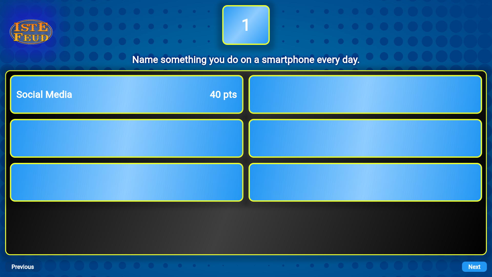
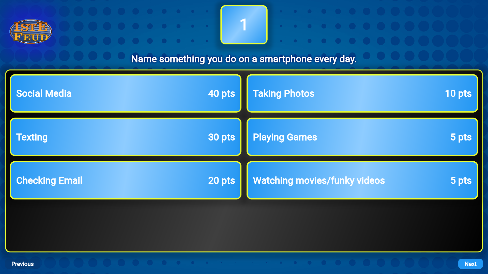

# **ISTE Connect**  
### *Ice-Breaking Session Game*  

ISTE-FEUD is a fun Flutter web app designed for ice-breaking sessions, inspired by the famous TV game show *Family Feud* hosted by Steve Harvey.

---

## **Features**  

- **Interactive Gameplay**:  
  - Press numbers **1 to 5** on the keyboard to reveal corresponding answers.  
  - Press **0** to display a wrong answer.  
  - Press **R** to reveal *all answers at once*.  
  - Click **Next** to move to the next question.
  - Better working in PC

- **Preloaded Questions**:  
  - A total of **14 preloaded questions** are available in the game.  
  - To add or modify questions, edit the `game.dart` file located in the `lib` folder.

---

## **How to Get Started**  

1. Clone the repository.  
2. Open the project in your preferred Flutter development environment.  
3. Run the app using `flutter run` in your terminal.  

---

## **Customization**  

To add more questions:  

1. Open `lib/game.dart`.  
2. Follow the format of existing questions and append new ones as needed.  
3. Save your changes and restart the app.

---

## **Controls Summary**  

| **Key**         | **Action**                                |  
|-----------------|-------------------------------------------|  
| `1 - 5`         | Reveal corresponding answers              |  
| `0`             | Display a wrong answer                    |  
| `R`             | Reveal all answers at once                |  
| `Next` (Button) | Proceed to the next question              |  

---

## **Contribution**  

Feel free to fork the repository, raise issues, or submit pull requests if you'd like to contribute to the project.  

---

## **Screenshots**  

  
  

  

*Figure 1: Home screen (left), Figure 2: Sample gameplay screen (right), Figure 3: Revealing answers during gameplay (below)*

